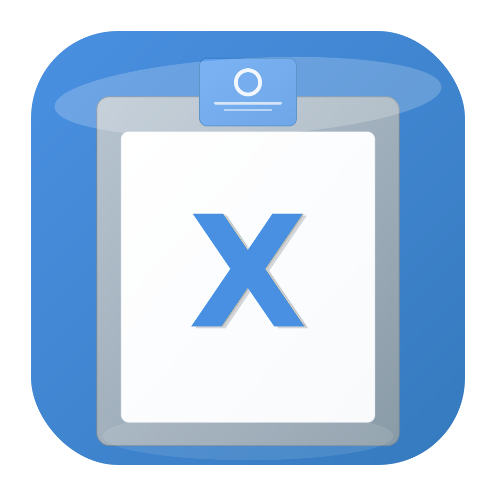

# CopyX - 强大的 macOS 剪切板管理工具

<div align="center">
  
  
  <p><strong>一个现代化、功能丰富的 macOS 剪切板管理应用</strong></p>
  
  
  
  
  
  
  
</div>

## 🌟 产品亮点

CopyX 是一款专为 macOS 设计的剪切板管理工具，采用最新的 SwiftUI 技术栈构建，提供流畅的用户体验和强大的功能。无论您是开发者、设计师还是普通用户，CopyX 都能显著提升您的工作效率。

## 📋 功能特色

### 🎯 核心功能

- **📚 智能剪切板历史** - 自动保存和管理剪切板历史记录，支持最多 1000 条记录
- **⌨️ 全局快捷键** - 可自定义快捷键（默认 `⌘⇧V`）快速访问
- **🔍 实时搜索** - 支持内容搜索和过滤，快速定位所需内容
- **📱 多格式支持** - 支持文本、图片、文件、链接等多种内容类型
- **🎨 现代化界面** - 基于 SwiftUI 的现代化设计，支持浅色/深色主题

### 🚀 高级特性

- **🔐 隐私保护** - 智能检测和过滤敏感信息（密码、信用卡等）
- **💾 数据管理** - 完整的数据备份和恢复功能
- **🎯 状态栏集成** - 轻量级状态栏应用，不占用 Dock 空间
- **⭐ 收藏夹功能** - 标记重要内容为收藏，永久保存
- **🌍 多语言支持** - 支持中文、英文、德文、法文、西班牙文、日文
- **🔄 智能清理** - 自动清理重复内容，保留收藏项目

### 🎨 用户体验

- **🖱️ 直观操作** - 点击复制，ESC 键退出，支持键盘导航
- **🎵 音效反馈** - 可选的操作音效提示
- **📐 自适应布局** - 窗口大小可调节，适配不同屏幕尺寸
- **⚡ 性能优化** - 低内存占用，启动速度快

## 🚀 快速开始

### 📋 系统要求

- **操作系统**: macOS 13.5 或更高版本
- **开发环境**: Xcode 15.0 或更高版本（仅开发需要）
- **架构支持**: Intel 和 Apple Silicon (M1/M2/M3)
- **内存**: 建议 4GB 以上
- **存储**: 约 50MB 可用空间

### 📦 安装方式

#### 方式一：下载预编译版本（推荐）

1. 访问 [Releases](https://github.com/your-username/CopyX/releases) 页面
2. 下载最新版本的 `CopyX.app.zip`
3. 解压后将 `CopyX.app` 拖入 `Applications` 文件夹
4. 首次运行可能需要在系统偏好设置中允许运行

#### 方式二：从源码构建

1. **克隆项目**

```bash
git clone https://github.com/your-username/CopyX.git
cd CopyX
```

2. **快速构建（推荐）**

```bash
# Debug 版本
./build.sh

# Release 版本
./build-release.sh
```

3. **手动构建**

```bash
# 使用 Xcode
open CopyX.xcodeproj

# 或使用命令行
xcodebuild -project CopyX.xcodeproj -scheme CopyX -configuration Release build
```

构建完成后，应用会输出到 `Products/CopyX.app`

### 🎯 首次使用

1. **启动应用**: 双击 `CopyX.app` 或从 Launchpad 启动
2. **授权访问**: 首次运行需要授予辅助功能权限
   - 系统偏好设置 → 安全性与隐私 → 隐私 → 辅助功能
   - 勾选 CopyX 应用
3. **状态栏图标**: 应用会在状态栏显示蓝色剪切板图标
4. **快速访问**: 使用默认快捷键 `⌘⇧V` 打开剪切板历史
5. **个性化设置**: 点击状态栏图标 → 设置，进行个性化配置

### 🔧 权限说明

CopyX 需要以下系统权限才能正常工作：

- **辅助功能权限**: 用于监听剪切板变化和全局快捷键
- **通知权限**: 用于显示操作反馈通知（可选）
- **文件访问权限**: 用于数据备份和恢复功能（可选）

## 📖 使用指南

### 基本操作

- **查看历史**: 使用快捷键 `⌘⇧V` 或点击状态栏图标
- **复制内容**: 点击历史记录项目或按回车键
- **删除记录**: 悬停在项目上点击删除按钮
- **搜索内容**: 在历史窗口顶部使用搜索框
- **清空历史**: 在历史窗口点击"清空历史"按钮

### 高级功能

#### 快捷键设置

- 在设置页面的"快捷键"标签页中
- 可以自定义全局快捷键组合
- 支持 Command、Option、Control、Shift 等修饰键

#### 显示样式

- **纵向布局**: 传统列表显示，适合查看详细信息
- **横向布局**: 网格显示，适合快速浏览

#### 内容类型管理

- 支持启用/禁用特定内容类型的监控
- 包括纯文本、图片、文件、链接等

#### 数据管理

- **导出数据**: 将剪切板历史导出为 JSON 文件
- **导入数据**: 从备份文件恢复剪切板历史
- **存储限制**: 可设置历史记录数量和存储空间限制

## ⚙️ 配置选项

### 通用设置

- 开机启动
- 菜单栏显示
- Dock 图标隐藏
- 通知开关

### 剪切板设置

- 最大历史记录数量
- 内容类型过滤
- 密码检测和过滤
- 音效提示

### 快捷键配置

- 全局快捷键启用/禁用
- 自定义快捷键组合
- 快捷键冲突检测

## 🛠️ 技术架构

### 🏗️ 技术栈

- **UI 框架**: SwiftUI + AppKit（原生 macOS 体验）
- **响应式编程**: Combine（数据流管理）
- **系统集成**: Carbon（全局快捷键）+ Cocoa（状态栏）
- **数据持久化**: UserDefaults + JSON（轻量级存储）
- **国际化**: NSLocalizedString（多语言支持）
- **构建系统**: Xcode Build System（支持 Intel 和 Apple Silicon）

### 🧩 核心组件

| 组件                  | 职责                 | 技术细节                      |
| --------------------- | -------------------- | ----------------------------- |
| `ClipboardManager`    | 剪切板监控和历史管理 | NSPasteboard 监听，定时器轮询 |
| `HotKeyManager`       | 全局快捷键处理       | Carbon API，系统级热键注册    |
| `LocalizationManager` | 多语言支持           | 动态语言切换，6 种语言支持    |
| `ShareManager`        | 分享功能             | NSSharingService 集成         |
| `TextProcessor`       | 文本处理工具         | 敏感信息检测，内容格式化      |

### 📊 数据模型

```swift
struct ClipboardItem {
    let id: UUID
    let content: String
    let type: ClipboardItemType
    let timestamp: Date
    var isFavorite: Bool
    let appName: String?
}
```

### 🔄 架构模式

- **MVVM**: Model-View-ViewModel 架构
- **观察者模式**: Combine + ObservableObject
- **单例模式**: 管理器类使用单例确保唯一性
- **工厂模式**: 视图组件的创建和配置

## 🔧 开发说明

### 📁 项目结构

```
CopyX/
├── Application/
│   └── CopyXApp.swift                 # 应用程序入口
├── Views/
│   ├── Main/
│   │   ├── ContentView.swift          # 主界面视图
│   │   ├── ClipboardHistoryView.swift # 历史记录视图
│   │   └── ClipboardItemView.swift    # 剪切板项目视图
│   ├── Settings/
│   │   ├── SettingsView.swift         # 设置主界面
│   │   ├── GeneralSettingsView.swift  # 通用设置
│   │   ├── HotKeySettingsView.swift   # 快捷键设置
│   │   ├── ClipboardSettingsView.swift# 剪切板设置
│   │   ├── DataSettingsView.swift     # 数据管理
│   │   ├── FavoritesSettingsView.swift# 收藏夹设置
│   │   ├── AdvancedSettingsView.swift # 高级设置
│   │   └── AboutView.swift            # 关于页面
│   ├── Components/
│   │   ├── SettingsComponents.swift   # 设置组件
│   │   └── UIComponents.swift         # UI 通用组件
│   └── Share/
│       └── ShareViews.swift           # 分享相关视图
├── Managers/
│   ├── ClipboardManager.swift         # 剪切板管理器
│   ├── HotKeyManager.swift            # 快捷键管理器
│   ├── LocalizationManager.swift     # 本地化管理器
│   └── ShareManager.swift            # 分享管理器
├── Models/
│   └── ClipboardItem.swift           # 数据模型
├── Utils/
│   └── TextProcessor.swift           # 文本处理工具
├── Resources/
│   ├── Assets.xcassets/              # 图标和资源
│   ├── en.lproj/Localizable.strings  # 英文本地化
│   ├── zh-Hans.lproj/Localizable.strings # 中文本地化
│   ├── de.lproj/Localizable.strings  # 德文本地化
│   ├── fr.lproj/Localizable.strings  # 法文本地化
│   ├── es.lproj/Localizable.strings  # 西班牙文本地化
│   └── ja.lproj/Localizable.strings  # 日文本地化
├── Products/                         # 构建输出目录
├── build.sh                          # Debug 构建脚本
├── build-release.sh                  # Release 构建脚本
├── BUILD_GUIDE.md                    # 构建指南
└── CopyX.entitlements               # 应用权限配置
```

### ⚙️ 构建配置

- **最低部署目标**: macOS 13.5
- **Swift 版本**: 5.0
- **应用分类**: 生产力工具 (Productivity)
- **Bundle ID**: com.copyx.app
- **版本**: 1.2.9
- **架构**: Universal (Intel + Apple Silicon)

### 🛠️ 开发工具

- **IDE**: Xcode 15.0+
- **版本控制**: Git
- **依赖管理**: 无外部依赖（纯原生实现）
- **构建系统**: xcodebuild + 自定义脚本
- **代码签名**: Apple Development Certificate

### 📋 开发规范

- **代码风格**: Swift 官方规范
- **注释**: 中英文混合，关键逻辑必须注释
- **命名**: 驼峰命名法，语义明确
- **架构**: MVVM 模式，单一职责原则
- **测试**: 单元测试覆盖核心逻辑

## 📄 许可证

本项目采用 MIT 许可证 - 查看 [LICENSE](LICENSE) 文件了解详情

## 🤝 贡献指南

我们欢迎任何形式的贡献！无论是 Bug 报告、功能请求还是代码贡献。

### 🐛 报告问题

在提交 Issue 前，请确保：

1. 搜索现有 Issues，避免重复提交
2. 提供详细的问题描述和复现步骤
3. 包含系统信息（macOS 版本、CopyX 版本等）
4. 如有可能，提供相关截图或日志

### 💡 功能请求

提交功能请求时，请：

1. 详细描述所需功能和使用场景
2. 说明该功能的价值和必要性
3. 提供可能的实现思路（可选）

### 🔧 代码贡献

1. **Fork 项目** 到你的 GitHub 账户
2. **创建功能分支**
   ```bash
   git checkout -b feature/amazing-feature
   ```
3. **编写代码** 并遵循项目规范
   - 保持代码风格一致
   - 添加必要的注释和文档
   - 确保新功能有对应的本地化翻译
4. **测试代码** 确保功能正常
5. **提交更改**
   ```bash
   git commit -m 'feat: add amazing feature'
   ```
6. **推送分支**
   ```bash
   git push origin feature/amazing-feature
   ```
7. **创建 Pull Request**

### 📝 提交规范

使用 [Conventional Commits](https://conventionalcommits.org/) 规范：

- `feat`: 新功能
- `fix`: Bug 修复
- `docs`: 文档更新
- `style`: 代码格式调整
- `refactor`: 代码重构
- `test`: 测试相关
- `chore`: 构建过程或辅助工具的变动

## 📞 联系我们

- **项目主页**: [https://github.com/your-username/CopyX](https://github.com/your-username/CopyX)
- **问题反馈**: [Issues](https://github.com/your-username/CopyX/issues)
- **功能建议**: [Discussions](https://github.com/your-username/CopyX/discussions)
- **邮箱**: copyx.app@gmail.com

## 📈 项目状态

- **开发状态**: 🟢 积极维护中
- **最新版本**: v1.2.9
- **支持系统**: macOS 13.5+
- **开源协议**: MIT License

## 🔄 更新日志

### v1.2.9 (最新)

- ✨ 新增 6 种语言支持（中/英/德/法/西/日）
- 🎨 全新的设置界面设计，采用系统设置风格
- 🔧 优化构建系统，支持 Products 文件夹输出
- 🐛 修复多项界面显示问题
- ⚡ 提升应用启动速度和响应性能

### v1.2.8

- 🎯 新增收藏夹功能
- 🔍 改进搜索算法
- 🛡️ 增强隐私保护

### v1.2.7

- 📱 支持更多内容类型
- 🎨 界面美化和用户体验优化
- 🔧 修复已知问题

查看完整 [更新日志](CHANGELOG.md)

## 🌟 Star History

[](https://star-history.com/#your-username/CopyX&Date)

## 🙏 致谢

特别感谢以下项目和开发者：

- **Apple** - 提供优秀的开发平台和工具
- **SwiftUI Community** - 分享宝贵的开发经验
- **所有贡献者** - 提供代码、建议和反馈

### 🎖️ 贡献者

<a href="https://github.com/your-username/CopyX/graphs/contributors">
  
</a>

## 📊 统计信息


---

<div align="center">
  <h3>🚀 如果 CopyX 对您有帮助，请给我们一个 ⭐ Star！</h3>
  <p>Made with ❤️ by CopyX Team</p>
  <p><sub>© 2024 CopyX. All rights reserved.</sub></p>
</div>
